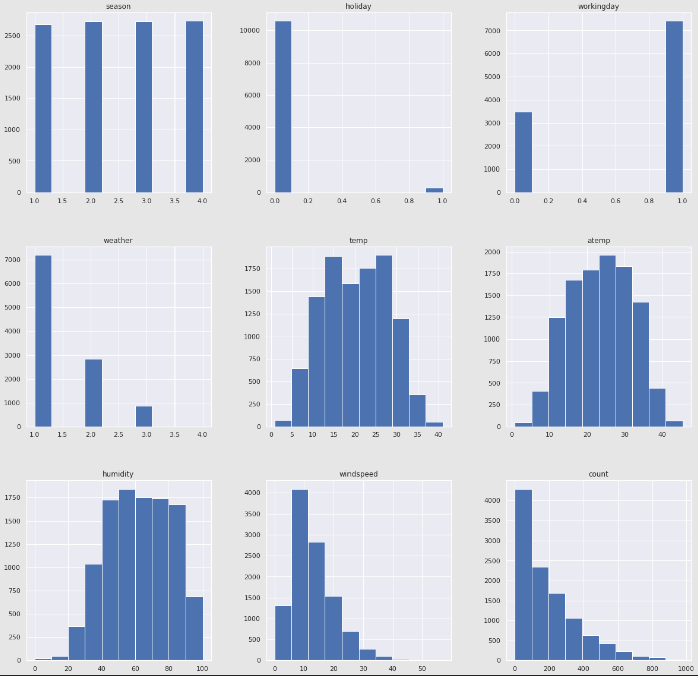
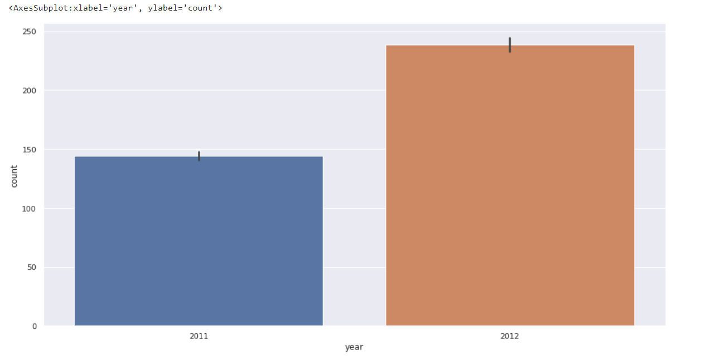
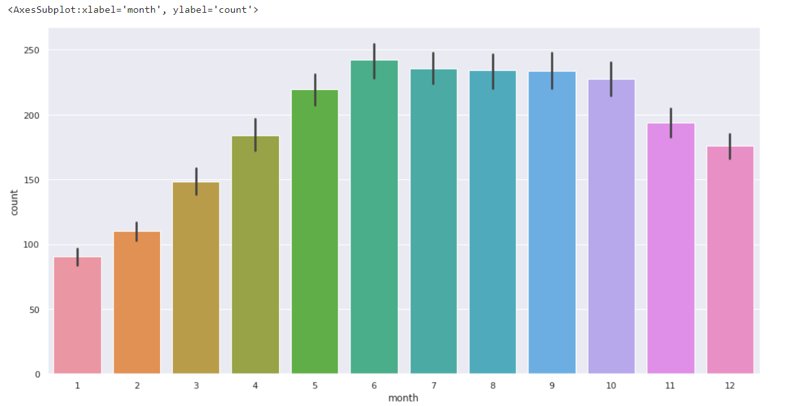
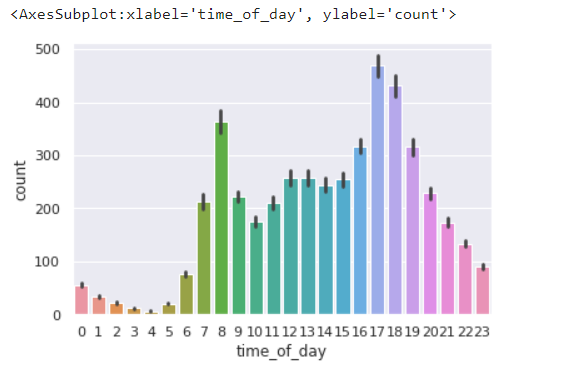
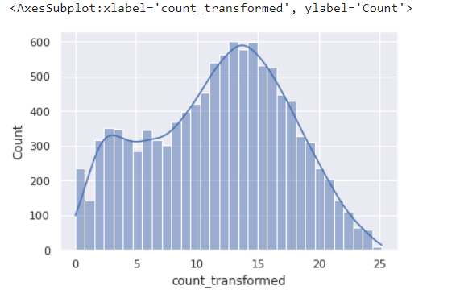

# Report: Predict Bike Sharing Demand with AutoGluon Solution
#### Subhasish Sarkar

## Initial Training

1. The rmse during training itself was quite bad, and I ended up with `-172` RMSE value during evaluation. This was the result of training the models on an unprocessed dataset with no hyperparameter optimization. 
2. Moreover, because there were negative values in the predictions, we could not submit the file and had to replace negative values with 0. It makes sense, as the demand for a bike is a positive quantity and cannot be negative. Those predictions were rubbish.
3. I trained a new model set with stack ensembling and bagging which is generally recommended in the documentation:
    * auto_stack=True, 
    * num_bag_folds=5,
    * num_bag_sets=2,
    * num_stack_levels=3,
    * save_space = True
    
    This essentially does the following:
    * `auto_stack = True` enables stacking of models in Autogluon. It allows AutoGluon to automatically utilize bagging and multi-layer stack ensembling to boost predictive accuracy.
    * `num_bag_folds = 5` this refers to the number of folds used for bagging of models. When `num_bag_folds` is equal to `k`, training time is roughly increased by a factor of `k`. Increasing `num_bag_folds` results in    models with lower bias, but that are more prone to overfitting.
    * `num_bag_sets = 2` refers to the number of repeats of kfold bagging to perform. The total number of models trained during bagging is equal to `num_bag_folds * num_bag_sets`.
    * `num_stack_levels = 3` refers to the number of stacking levels to use in stack ensemble. Roughly increases model training time by factor of `num_stack_levels + 1`.
    * `save_space = True` states whether or not to reduce the memory and disk size of predictor by deleting auxiliary model files that aren’t needed for prediction on new data. This has no impact on inference accuracy, and can be set to `True` if the only intention is to use the model for generating predictions, which is what we want to do.
    
4. After stack ensembling and bagging, I ended up with an evaluation metric of `-92` RMSE. Which is a significant improvement upon the original score. After this, I increased the time limit to 3600 seconds to let all the models train for 1 hour to see if that improved model performance.
5. After training the model for 1 hour, the RMSE improved to `-89.72`, which isn't a significant improvement over training for only 10 minutes. So we can let the models train for only 10 minutes without much impact on the prediction performance.
6. Finally I made a submission to kaggle with this initial model, and got a score of `1.83241` on the kaggle metric. This serves as the baseline metric.

### What was the top ranked model that performed?
The top ranked models for all training were the weighted stack ensembles.

1. For the initial model: WeightedEnsemble_L4 followed by WeightedEnsemble_L3 and CatBoost_BAG_L3
2. For the model with feature engineering: 
3. For the model with feature engineering and hpo: 

## Exploratory data analysis and feature creation
### What did the exploratory analysis find and how did you add additional features?

A detailed step-by-step is provided in the jupyter notebook that accompanies this report, however I shall break it down into simple steps here.

Exploratory Analysis was started by:

1. First and foremost looking at the distribution of all the features. I plotted a historgram of all the features, and then made a judgement on the correlation of certain variables with each other. I 
    * `holiday` and `workingday` initially seemed negatively correlated, which makes sense because if a day is considered a working day, it cannot be a holiday. But there is no clear way to combine the two variables into one, and having them both as independent predictors in the model seemed to work better than removing one of them. This also makes sense because these variables are also somewhat related to the casual and registered users, whose information we are removing.  
    * `weather` seems to be correlated with `count`. This is interesting because the weather column is a ordinal value initially, however it is referrring to a categorical entity. This was changed into a categorical feature to make more sense.
    * `temp` and `atemp` are also correlated features, as when actual temperatures are higher, it will also be perveived like higher temperatures. So we can assume that only one of these features can be included in the model. I have decided to keep the `atemp` feature, as it is more likely to cause a rider to decide whether they want to bike or not. It does not really matter what the objective temperature is, as long as it feels like a certain acceptable temperature, people will not want to bike.
    * `humidity` is related to the `weather`. If it is more humid, people are less likely to take bikes. Since this is also a categorical variable that is ordinal in the dataset, we have one-hot encoded it.
    * `windspeed` is a continuous variable, we look into it later on.
    * `season` is also a categorical feature which is one-hot encoded.
    * `datetime` is parsed to give out year, month, day, time of the day etc, and further analysis is done to figure out rush-hour times, seasonal monthly and daily trends in bike demand.

This can be seen from the following image:

2. The next step was performing the one-hot encoding of the categorical features, and adding the one-hot vectors to the dataset

3. The `atemp` feature needed to be binned into relevant bins since there wasn't a strong correlation with the target variable. There was a slight non-linearity in the relationship between the feature and the target. As such, a decision tree was used to perform feature binning. This is because the main purpose of feature binning is not met by performing random, count, or quartile-based bucketing. The idea is to find the best set of buckets or bins using a decision tree model that will involve correlation with the target variable.

Once the best set of hyperparameters were obtained from a Grid Search method, they were used to model a Regression Tree, and based on the splits in the nodes, the bins were obtained. This is detailed in the notebook.

4. `datetime` was then parsed to obtain the year, month, day and hour features. All of which gave some information:
    * `Year` let us identify that there was a yearly trend in the demand for bikes. This could be due to external factors, but there was a significant increase for demand in bikes in 2012 than in 2011. Since our testing data contains samples from 2011, it is safe to assume this will be a good predictor variable.

    

    * `Month` let us identify monthly or seasonal trends in bike demand. It was seen that demand sees a spike in the months from January to June. Then remains pretty constant, and decreases from October to December. This seasonal trend is also a powerful predictor

    

    * `Day` lets us identify the daily trends in bike demand over the 2 years. It needed to be processed a bit to identify weekdays from weekends. There was pretty much consistent demand throughout the week, except for Sunday. This makes sense because people who do not go to work or school on bikes will not be using it on Sundays.
    
    
    * `Hour` let us identify hourly trends in bike demand. It needed to again be binned into intervals because there isn't a direct linear relationship between `hour` and `count`. This non-linearity can however be modelled using Decision Trees. So like we did for `atemp`, we binned hour into separate categories wrt intervals. There was however a very clear indicator which was, hours from 7-10AM, 12-2PM, and 5-8PM were the times where most demand was seen. These are peak times when people are either leaving for work/school, or going to lunch, or returning from work/school. This is thus a very powerful predictor.

    

5. `humidity` was seen as a pretty normally distributed continuous variable, and thus not much needed to be done there. It was just normalization using `min-max normalization` to have its values between 0 and 1.

6. `windspeed` however was a heavily skewed variable. It displayed right skewness, and thus needed to be transformed before being put into any model. The main problem was that a lot of the values in this feature were 0. This was strange as for similar conditions (like weather, humidity, seasons, etc) in other samples, the windspeed was more than 0. 

This could only mean that the samples which had 0 windspeed were wrong. 

The only thing that could be done was to treat the 0 values as missing values, and design an imputer that would take into account the other features that affected windspeed (like the seasons, humidity, temperature) and predict the windspeed. 

As such an XGBoost Regression model was used (among other models, however the XGBoost one gave the best results), to model the windspeed feature with new imputed values. In order to now conform it into a normally distributed feature there were 2 options:
* `Log Transformation` - which took the log of all the values, which usually is applied to right skewed data, in order to make it more normally distributed,
* `Box Cox Transformation` - which is a more generalized method of conforming any non-normal distribution into a more normal shape, based on the $\lambda$ parameter. In fact when $\lambda = 0$, the box cox transformation actually equates to the log transformation.

Using the two above methods, it was seen that performing box cox transformation with $\lambda=-0.035$ makes the `windspeed` the most normally distributed. 

7. It was also seen that the `count` target variable itself was not normally distributed. It displayed heavy right skewness. I have tried to use both boxcox transformation and log transformation for it, and the best results were obtained from the log transformation. 

    The original count had a distribution like so:

    

    The transformed count had a distribution like so:

    
    
This is to be expected also because, the metric used in the kaggle competition is the `RMSLE` which takes the root mean squared of the log errors. So if we can train our models on the log values, the loss function during training itself becomes the RMSLE; rather than training on actual values in which case the loss function is the RMSE.

8. After this, the data was pre-processed and ready for modelling.
 
### How much better did your model preform after adding additional features and why do you think that is?
After performing EDA and feature engineering, the model performance went from having an `RMSLE = 1.8` to `RMSLE = 0.529` which was a significant improvement.

This is the case because as discussed above:
* A lot of the features were not exactly correlated to the target, and required transformations like feature binning, or one-hot encoding
* The temperature features were collinear features which needed to be discarded in order to remove variance inflation of the standard errors
* There were continous features which were not normally distributed which prevents models from modelling their relationship to the target properly
* The target variable itself was not normally distributed leading to high variance in the predictions, thus decreasing prediction performance.

Fixing all of these issues hence brought down the RMSLE value by a significant amount.

## Hyper parameter tuning
### How much better did your model preform after trying different hyper parameters?
Hyperparameter tuning was done in 2 ways:
* More general set of hyperparameters of the AutoGluon `TabularPredictor`, as detailed above, and
* Induvidual model hyperparameters as follows:
    * **Torch Neural Network**: 
        * `num_epochs` was set to $50$, 
        * `learning_rate` was searched on a logarithmic scale from $3e-4$ to $1e-2$, 
        * `activation` function was searched between `relu` and `tanh`, 
        * `dropout_prob` was searched from $0.5$ to $1$

    * **LightGBM**:
        * `learning_rate`: $3e-4$ to $0.3$ on a logarithmic scale,
        * `num_boost_round`: was set to $1000$, 
        * `num_leaves`: was searched from $26$ to $66$,
        * `max_depth`: was searched from $3$ to $10$

    * **XGBoost**:
        * `n_estimators`: was set to $1000$,
        * `learning_rate`: was searched from $1e-4$ to $3e-1$, on a logarithmic scale
        * `colsample_bytree`: was searched from $1e-4$ to $1$, on a logarithmic scale
        * `lambda`: was searched from $1e-4$ to $1$, on a logarithmic scale 

### If you were given more time with this dataset, where do you think you would spend more time?

1. As per some reading of the discussion on the Kaggle forum, I found that people were modelling Casual and Registered users and then using that to calculate Count in the final test dataset. I would like to look into this, and see if it causes any sort of improvement to the models. 
2. I also would like to look into if the holiday and workingdays were all correctly labeled. There were some instances like 24th/25th of December (Christmas Eve and Day), 31st December/1st Jan (New Year's eve and New Years Day) which were labeled as working days. There may be other samples that I would like to look into
3. I would also like to spend more time making more complicated models, using custom models in AutoGluon, and experiment with custom stacking and ensembling.

### Create a line plot showing the top model score for the three (or more) training runs during the project.

### Create a line plot showing the top kaggle score for the three (or more) prediction submissions during the project.

## Summary
In conclusion, this project deals with the exploration and analysis of bike demand data, and after performing extensive EDA and feature engineering, models were made using AutoGluon. Hyperparameter optimization was explored to get the best set of model parameters, and the best model scored `RMSLE = 0.512` on the Kaggle platform.  
